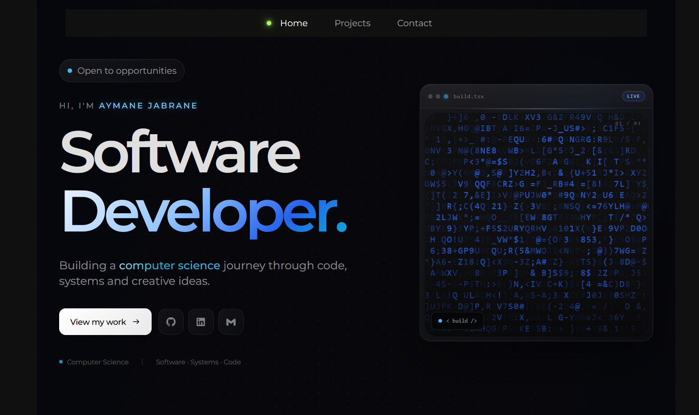

# Aymane Jabrane — Software Developer Portfolio

<p align="center">
  <a href="https://aymanejab01.github.io/">
    
  </a>
</p>

<p align="center">
  <strong>Building a computer science journey through code, systems and creative ideas.</strong>
</p>

<p align="center">
  <a href="https://aymanejab01.github.io/">🌐 Live Portfolio</a>
  &nbsp;·&nbsp;
  <a href="https://github.com/AymaneJab01">💻 GitHub</a>
  &nbsp;·&nbsp;
  <a href="#projects">🚀 Projects</a>
  &nbsp;·&nbsp;
  <a href="#technologies">🛠️ Technologies</a>
</p>

<p align="center">
  
  
  
  
  
  
</p>

---

## ✨ Overview

Welcome to my personal developer portfolio.

I'm **Aymane Jabrane**, a Software Developer interested in building software, understanding computer systems, and exploring the relationship between hardware and software.

This portfolio is designed to be more than a traditional résumé website. It combines:

* 💻 Software projects
* 🧠 Computer science concepts
* ⚙️ Interactive simulations
* 📚 Technical notes
* 🌐 Web development
* 🔬 Experiments
* 🖥️ Developer-oriented interfaces

The portfolio continuously evolves as I learn, experiment, and build new projects.

### 🌐 Live Website

**[Visit my portfolio →](https://aymanejab01.github.io/)**

---

<details>
<summary><strong>📑 Table of Contents</strong></summary>

<br>

* [✨ Overview](#-overview)
* [🚀 Highlights](#-highlights)
* [🛠️ Technologies](#️-technologies)
* [🧠 What I Explore](#-what-i-explore)
* [📚 Notes & Learning](#-notes--learning)
* [💻 Interactive Terminal](#-interactive-terminal)
* [🚀 Projects](#-projects)
* [🏗️ Architecture](#️-architecture)
* [📁 Project Structure](#-project-structure)
* [⚙️ Development](#️-development)
* [🌐 Deployment](#-deployment)
* [📸 Portfolio Preview](#-portfolio-preview)
* [🔗 Links](#-links)
* [📜 License & Attribution](#-license--attribution)
* [👤 Author](#-author)

</details>

---

# 🚀 Highlights

<table>
<tr>
<td width="50%">

### ⚡ Fast

Built with **Astro** for a performant web experience.

</td>

<td width="50%">

### 🎨 Interactive

Developer-focused interfaces and interactive experiences.

</td>
</tr>

<tr>
<td width="50%">

### 🧠 Educational

Computer science concepts are presented through notes, visualizations and simulations.

</td>

<td width="50%">

### 🔬 Experimental

The portfolio is also a place to experiment with new technologies and ideas.

</td>
</tr>
</table>

---

# 🛠️ Technologies

## Languages

<p>
  
  
  
  
  
  
  
</p>

## Web & Frameworks

<p>
  
  
  
  
  
  
  
  
</p>

## Tools & Platforms

<p>
  
  
  
  
  
  
  
  
</p>

---

# 🧠 What I Explore

## 🌐 Web Development

My web development interests include:

* Single Page Applications
* Landing pages
* Business websites
* Portfolio websites
* Frontend development
* React
* Astro

---

## 🤖 Machine Learning

I'm exploring:

* Machine learning fundamentals
* Data preprocessing
* Data analysis
* Supervised learning
* Unsupervised learning
* Practical machine learning applications

---

## 🖥️ Computer Architecture

Areas I'm studying include:

* Computer organization
* CPU fundamentals
* Memory fundamentals
* Instruction sets
* Fetch-decode-execute cycles
* Hardware/software interaction

---

## ⚙️ Systems

I'm also interested in:

* Operating system fundamentals
* Computer components
* Peripherals
* Low-level computing
* Computer networks
* Hardware/software interaction

---

# 📚 Notes & Learning

The portfolio contains a growing collection of technical notes and concepts explored throughout my computer science journey.

| Topic                                | Area             |
| ------------------------------------ | ---------------- |
| Hash Tables — Practical View         | Data Structures  |
| Computer from a Hardware Perspective | Computer Science |
| Hash Tables — Definitions            | Data Structures  |
| Git & GitHub                         | Development      |
| Analog vs Digital Signals            | Systems          |
| Java                                 | Programming      |

The notes evolve alongside my studies and projects.

---

## 🖥️ Interactive Terminal

The portfolio includes a custom developer terminal. Try these commands:

### Info / About
| Command | Description |
|---|---|
| `help` | List all available commands |
| `whoami` | Display developer information |
| `about` | Learn more about me |
| `skills` | View technologies and areas of focus |
| `education` | View my computer science background |
| `status` | Check current availability |

### Projects
| Command | Description |
|---|---|
| `projects` | List all projects |
| `open <number\|name>` | Jump to a project by number or name (e.g. `open 4`, `open visualizer`) |
| `visualizer` | Preview the Algorithm Visualizer (sorting, hashing, pathfinding), then open it |
| `weather` | Fetch **live weather** for Alcoi, Valencia & Torrevieja, then open the dashboard |
| `movie-ranking` | Show my top-rated movies, then open the full list |
| `cpu` | Show the CPU Simulator's specs (registers, memory, instruction set), then open it |
| `network` | Open the Network Protocol Simulator |
| `expense-splitter` | Open the Expense Splitter app |
| `fintrack` | Show the FinTrack app's feature summary, then open it |

### Navigation / Contact
| Command | Description |
|---|---|
| `notes` | Open my study notes |
| `contact` | Get in touch |
| `github` | Open my GitHub profile |
| `linkedin` | Open my LinkedIn profile |

### Terminal Controls
| Command / Key | Description |
|---|---|
| `clear` | Clear the terminal |
| `↑` / `↓` | Cycle through command history |
| `Tab` | Autocomplete the current command |

### Try it

**[→ Open the interactive portfolio](https://aymanejab01.github.io/)**

---

# 🚀 Projects

The portfolio currently features several projects and interactive experiments.

---

## 01 — Interactive Developer Terminal

> A developer-style terminal built directly into the portfolio.

The terminal provides an interactive way of exploring:

* My work
* Skills
* Projects
* Contact information
* Portfolio information

**Technologies**

`Astro` `TypeScript` `Interactive UI`

---

## 02 — Movie Ranking

> A movie ranking interface for exploring films through covers, ratings and personal reviews.

The project demonstrates a movie-focused interactive interface.

### Featured

**Avengers: Infinity War**

⭐ **Rating: 9/10**

**Technologies**

`Astro` `UI` `Movies`

---

## 03 — Live Weather Dashboard

> A dynamic weather dashboard displaying live weather conditions.

The dashboard provides weather information for:

* 📍 Alcoi
* 📍 Valencia

It combines live API data with a developer-focused interface.

**Technologies**

`Astro` `API` `JavaScript`

---

## 04 — Computer Science Algorithm Visualizer

> An interactive playground for watching data structures and algorithms work.

### Sorting

* Comparisons
* Swaps
* Step-by-step execution

### Hashing

* Hash tables
* Collision handling
* Chaining

### Pathfinding

* Dijkstra's algorithm
* A* algorithm
* Grid-based pathfinding

**Technologies**

`Astro` `TypeScript` `Data Structures & Algorithms`

---

## 05 — Network Protocol Simulator

> An interactive simulator for understanding transport-layer networking concepts.

The simulator explores:

* TCP three-way handshake
* TCP vs UDP
* Packet loss
* Retransmission
* Message framing
* Byte streams

The goal is to make networking concepts easier to understand through interactive visualization.

**Technologies**

`Astro` `TypeScript` `TCP/UDP`

---

## 06 — CPU Simulator

> A small simulated CPU designed to demonstrate fundamental computer architecture concepts.

The simulator includes:

* 8 registers
* Custom instruction set
* Assembly-like programming
* Fetch
* Decode
* Execute
* Memory
* Live register changes

The simulator allows individual instructions to be executed step by step while observing how the CPU state changes.

**Technologies**

`Astro` `TypeScript` `Assembly`

---

## 07 — Flutter Expense Splitter

> A Flutter application for managing shared group expenses.

The application focuses on:

* Shared expenses
* Individual balances
* Debt calculation
* Expense management
* Settling debts with a minimum number of transfers

**Technologies**

`Flutter` `Dart`

**Platforms**

`Mobile` `Web`

---

## 08 — FinTrack (Personal Finance Manager)

> A friendly Flutter finance app for tracking spending, accounts, budgets and savings goals — designed around adding and managing personal data as easily as possible.

The application focuses on:

* A dashboard with cash balance, quick "Add Money" / "Withdraw" actions and recent activity
* Guided, validated forms for adding transactions, linked accounts, budgets and goals
* Editing and deleting existing entries directly from their lists (tap to edit, swipe to delete)
* An editable personal profile (name, email, phone)
* Spend-by-category analytics and a weekly spending chart
* Consistent **Back** and **Home** navigation on every screen, including on desktop window sizes

**Technologies**

`Flutter` `Dart` `Provider` `SQLite` `go_router` `fl_chart`

**Platforms**

`Mobile` `Desktop` `Web`

---

# 🏗️ Architecture

At a high level, the portfolio follows an Astro-based architecture.

```text
                         PORTFOLIO
                             │
             ┌───────────────┼───────────────┐
             │               │               │
             ▼               ▼               ▼
         ┌───────┐       ┌────────┐      ┌─────────┐
         │ Astro │       │ React  │      │  CSS/UI │
         │ Pages │       │Components│    │ Styling │
         └───┬───┘       └────┬───┘      └────┬────┘
             │                │               │
             └────────────────┼───────────────┘
                              │
                              ▼
                       ┌─────────────┐
                       │ Astro Build │
                       │    /dist    │
                       └──────┬──────┘
                              │
                              ▼
                     🌐 LIVE WEBSITE
```

---

# 📁 Project Structure

```text
.
├── public/
│   └── ...
│
├── src/
│   ├── components/
│   │   └── ...
│   │
│   ├── layouts/
│   │   └── ...
│   │
│   ├── pages/
│   │   └── ...
│   │
│   └── ...
│
├── docs/
│   └── portfolioprevi.png
│
├── astro.config.mjs
├── package.json
├── pnpm-lock.yaml
├── tailwind.config.mjs
├── tsconfig.json
└── README.md
```

---

# ⚙️ Development

## Requirements

* Node.js
* pnpm
* Git

## Clone

Because the development repository is private:

```bash
git clone <PRIVATE_REPOSITORY_URL>
cd <PROJECT_DIRECTORY>
```

## Install dependencies

```bash
pnpm install
```

## Start development server

```bash
pnpm dev
```

## Build

```bash
pnpm run build
```

## Preview production build

```bash
pnpm preview
```

---

# 🌐 Deployment

The portfolio is publicly accessible at:

### 🌐 [aymanejab01.github.io](https://aymanejab01.github.io/)

The website is built with Astro and deployed as a static web application.

The distinction between the website and source code is intentional:

```text
PRIVATE SOURCE
      │
      │ Build
      ▼
STATIC WEBSITE
      │
      ▼
PUBLIC INTERNET
```

The development source repository can remain private while the finished portfolio remains publicly accessible.

---

# 📸 Portfolio Preview

Click the image below to visit the live portfolio.

<p align="center">
  <a href="https://aymanejab01.github.io/">
    
  </a>
</p>

<p align="center">
  <sub>Click the preview to open the live portfolio.</sub>
</p>

---

# 🔗 Links

<p align="center">
  <a href="https://aymanejab01.github.io/">
    🌐 <strong>Portfolio</strong>
  </a>
  &nbsp;&nbsp;•&nbsp;&nbsp;
  <a href="https://github.com/AymaneJab01">
    💻 <strong>GitHub</strong>
  </a>
</p>

---

# 📜 License & Attribution

This portfolio is based on the **Astro Portfolio** template originally created by **Oscar Hernandez / Gothsec**.

The original repository is:

**Gothsec/Astro-portfolio**

The original project is distributed under the **MIT License**.

The original license and copyright notice are retained in this project in accordance with the original license terms.

### Original Template

Copyright © 2026 Oscar Hernandez.

The original MIT license permits modification and redistribution provided that the original copyright notice and license text are retained.

### My Work

This portfolio also contains original work created by **Aymane Jabrane**, including:

* Portfolio content
* Project descriptions
* Documentation
* Personal branding
* Design modifications
* Interactive experiences
* Computer science visualizations
* Project implementations
* Additional features and modifications

Third-party libraries, frameworks, icons, fonts, assets and dependencies remain subject to their respective licenses.

---

# 👤 Author

## Aymane Jabrane

**Software Developer**

> Building a computer science journey through code, systems and creative ideas.

### 🌐 Portfolio

**[aymanejab01.github.io](https://aymanejab01.github.io/)**

### 💻 GitHub

**[github.com/AymaneJab01](https://github.com/AymaneJab01)**

---

<p align="center">
  <sub>Built with curiosity, code and a lot of debugging.</sub>
</p>
